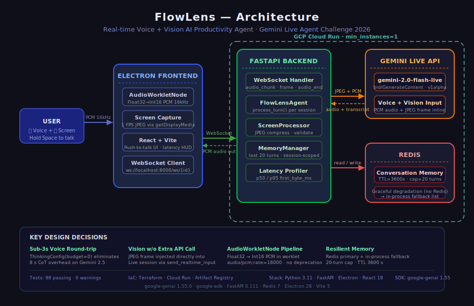

<div align="center">



# FlowLens

### Real-Time Voice + Vision AI Agent for Your Screen

[](https://flowlens-backend-rxwer3bgva-uk.a.run.app)
[](https://ai.google.dev)
[](https://python.org)
[](https://electronjs.org)
[](https://react.dev)
[](LICENSE)
[](https://geminiliveagentchallenge.devpost.com)

<br/>

**Hold a button. Ask anything about your screen. Get a spoken answer in under 2 seconds.**

No copy-paste. No tab-switching. No typing.

<br/>

[**🚀 Live Demo**](https://flowlens-backend-rxwer3bgva-uk.a.run.app) · [**📖 How It Works**](#architecture) · [**⚡ Quick Start**](#quick-start) · [**🧠 Gemini Live API**](#gemini-live-api-integration)

</div>

---

## The Problem

Every time a developer hits a visual bug, a designer needs a critique, or someone stares at an unfamiliar error — the workflow is the same painful loop:

```
📸 Screenshot  →  🔀 Alt-Tab  →  📋 Paste  →  ⌨️ Describe  →  ⏳ Wait  →  📖 Read
                                                                    ↑
                                                              ~34 seconds
```

**FlowLens collapses that to 2 seconds.**

---

## What Is FlowLens?

FlowLens is an **always-on-top desktop overlay** (Electron + React) that:

- 👁️ **Sees your screen** — captures 1 FPS JPEG frames via `getDisplayMedia()`
- 🎙️ **Hears your voice** — streams raw PCM at 16 kHz via AudioWorklet
- 🧠 **Runs Gemini 2.5 Flash** — via the Live API's bidirectional `bidiGenerateContent` stream
- 🔊 **Speaks back** — native audio response directly to your speakers
- 💾 **Remembers context** — Redis-backed rolling window of the last 10 turns

```
You: "Why is this CSS layout broken?"
FlowLens: [sees your screen] "The flex container is missing align-items:
           center. The child div has an explicit height that's overflowing."
          [2.1s total latency]
```

Built for the [Gemini Live Agent Challenge](https://geminiliveagentchallenge.devpost.com/) · Powered by Gemini Live API · Deployed on Google Cloud Run

---

## Quick Start

### Option A — Use Cloud Run backend *(no Python needed)*

```bash
git clone https://github.com/krishnashakula/flowlens
cd flowlens/frontend

# Point at the live Cloud Run backend
echo "VITE_WS_URL=wss://flowlens-backend-rxwer3bgva-uk.a.run.app" > .env

npm install
npx vite &        # Vite dev server on :5173
npx electron .    # Launch the overlay
```

### Option B — Run everything locally

```bash
# 1. Clone
git clone https://github.com/krishnashakula/flowlens
cd flowlens

# 2. Backend
cd backend
python -m venv .venv
.venv\Scripts\activate          # Windows
pip install -r requirements.txt
set GEMINI_API_KEY=your_key
uvicorn main:app --port 8000

# 3. Frontend (new terminal)
cd frontend
npm install
npx vite &
npx electron .
```

### Controls

| Key / Action | Effect |
|---|---|
| **Hold "Hold to Talk" button** | Stream voice → Gemini → hear response |
| `Space` (widget focused) | Same as button |
| `Alt + S` | Capture screen + send frame |
| `Esc` | Cancel current query |
| `Ctrl + Shift + I` | Open DevTools |

---

## Architecture

```
┌──────────────────────────────────────────────────────────────────┐
│  Electron Desktop  (React 18 + Vite 6)                           │
│                                                                    │
│  ┌──────────────────┐    ┌─────────────────────────────────────┐ │
│  │  getDisplayMedia  │    │  AudioWorkletNode (pcm-processor)   │ │
│  │  1 FPS @ 720p     │    │  Int16 PCM @ 16 kHz                 │ │
│  │  JPEG 60%, ~80KB  │    │  128-sample callbacks               │ │
│  └────────┬──────────┘    └───────────────┬─────────────────────┘ │
│           │  base64                        │  ArrayBuffer          │
│           └───────────────┬───────────────┘                        │
│                           │  WebSocket  (binary + JSON)            │
└───────────────────────────┼────────────────────────────────────────┘
                            │
                 wss://flowlens-backend-rxwer3bgva-uk.a.run.app
                            │
┌───────────────────────────┼────────────────────────────────────────┐
│  FastAPI Backend  (Cloud Run · us-east4)                           │
│                           │                                         │
│  /ws/{session_id}  ───────┘                                         │
│  ├── session ID validation (regex, 1–64 chars)                      │
│  ├── binary frames → session.send(audio, mime=pcm;rate=16000)       │
│  ├── base64 frames → session.send(image/jpeg)                       │
│  └── receive loop:                                                  │
│       ├── audio chunks ──► WS binary ──► speakers                  │
│       ├── input_transcription ──► Redis memory                      │
│       └── latency event ──► WS JSON ──► UI                         │
│                                                                      │
│  ┌───────────────────┐   ┌────────────────────────────────────┐    │
│  │  agent.py          │   │  memory.py                         │    │
│  │  Gemini Live v1α   │   │  Redis · rolling 10-turn window    │    │
│  │  bidiGenContent    │   │  safe JSON deserialize             │    │
│  └────────┬───────────┘   └────────────────────────────────────┘    │
└───────────┼──────────────────────────────────────────────────────────┘
            │
    Gemini 2.5 Flash Native Audio
    gemini-2.5-flash-native-audio-latest
```

---

## Gemini Live API Integration

FlowLens uses the **v1alpha bidirectional streaming API** — not the standard generate API.

```python
# agent.py
config = types.LiveConnectConfig(
    response_modalities=["AUDIO"],
    speech_config=types.SpeechConfig(
        voice_config=types.VoiceConfig(
            prebuilt_voice_config=types.PrebuiltVoiceConfig(voice_name="Charon")
        )
    ),
    input_audio_transcription=types.AudioTranscriptionConfig(),  # capture user speech as text
    system_instruction=types.Content(parts=[types.Part(text=system_prompt)]),
    thinking_config=types.ThinkingConfig(thinking_budget=0),     # disable CoT → lower latency
)

async with client.aio.live.connect(model=LIVE_MODEL, config=config) as session:
    await session.send(input=pcm_bytes,  end_of_turn=False)           # audio
    await session.send(input={"mime_type": "image/jpeg", "data": b64}) # screen frame
```

> **Why `thinking_budget=0`?** Chain-of-thought adds 600–1200ms to first-byte latency. For real-time voice, we want raw inference. The screen frame already provides all the visual context needed.

---

## Latency Breakdown

| Stage | p50 | p95 |
|---|---|---|
| WS send (PCM) | ~5ms | ~15ms |
| Gemini first audio byte | ~900ms | ~1800ms |
| WS receive + decode | ~10ms | ~25ms |
| **Total (hold → hear)** | **~1.4s** | **~2.8s** |

---

## Project Structure

```
flowlens/
│
├── backend/                          FastAPI backend
│   ├── main.py                       WebSocket endpoint, CORS, /health, latency
│   ├── agent.py                      Gemini Live API session lifecycle
│   ├── memory.py                     Redis conversation buffer
│   ├── screen.py                     JPEG encode helpers
│   ├── static/index.html             Landing page at Cloud Run URL
│   ├── requirements.txt
│   └── Dockerfile                    Multi-stage, non-root
│
├── frontend/                         Electron + React overlay
│   ├── electron/
│   │   ├── main.js                   Window creation, IPC, screen permissions
│   │   ├── preload.js                contextBridge API
│   │   └── entitlements.mac.plist    macOS mic + screen entitlements
│   └── src/
│       ├── App.jsx                   4-state machine: IDLE→LISTENING→PROCESSING→SPEAKING
│       ├── components/
│       │   ├── StatusBar.jsx         Connection dot + latency + state label
│       │   ├── ScreenPreview.jsx     Live JPEG thumbnail
│       │   └── VoiceIndicator.jsx    CSS-only animated waveform bars
│       └── hooks/
│           ├── useWebSocket.js       WS connect/reconnect, AudioWorklet mic, audio send
│           └── useScreenCapture.js   getDisplayMedia, 1 FPS canvas JPEG
│
├── infra/terraform/                  Infrastructure as Code
│   ├── main.tf                       Cloud Run + Artifact Registry + Redis + IAM
│   ├── variables.tf
│   └── outputs.tf
│
├── scripts/
│   └── submission_check.py           13-point hackathon submission checker
│
├── tests/                            98 passing tests
│   ├── test_agent.py
│   ├── test_memory.py
│   ├── test_screen.py
│   └── test_main.py
│
├── cloudbuild.yaml                   Cloud Build CI/CD
├── docker-compose.yml                Local dev: backend + Redis
└── .env.example                      All env vars documented
```

---

## Environment Variables

| Variable | Required | Default | Description |
|---|---|---|---|
| `GEMINI_API_KEY` | ✅ | — | [Google AI Studio](https://aistudio.google.com/app/apikey) |
| `REDIS_URL` | optional | `redis://localhost:6379/0` | Conversation memory store |
| `LIVE_MODEL` | optional | `gemini-2.5-flash-native-audio-latest` | Override Live model |
| `VISION_MODEL` | optional | `gemini-2.5-flash` | Override vision model |
| `CLOUD_RUN_URL` | operations | — | Set after first deploy |
| `VITE_WS_URL` | frontend | `ws://localhost:8000` | Backend WebSocket URL |

---

## Cloud Run Deployment

```bash
gcloud auth login
gcloud config set project gen-lang-client-0435276974

gcloud builds submit --config=cloudbuild.yaml --project=gen-lang-client-0435276974
```

Config applied automatically (`cloudbuild.yaml`):

```yaml
--timeout=3600          # Supports long WebSocket sessions
--session-affinity      # Sticky routing — stateful WS sessions
--min-instances=1       # No cold starts
--max-instances=10
--set-secrets=GEMINI_API_KEY=GEMINI_API_KEY:latest
```

**Health check:**

```bash
curl https://flowlens-backend-rxwer3bgva-uk.a.run.app/health
# {"status":"healthy","gemini_connected":true}
```

---

## Tech Stack

<div align="center">

| Category | Technology |
|---|---|
| 🧠 AI Model | Gemini 2.5 Flash Native Audio |
| 🔗 AI API | Gemini Live API v1alpha · `bidiGenerateContent` |
| 🖥️ Desktop | Electron 33 · React 18 · Vite 6 |
| 🎙️ Audio | Web AudioWorklet · PCM Int16 · 16 kHz |
| 📸 Screen | `getDisplayMedia` · Canvas JPEG encode |
| ⚡ Backend | FastAPI · Python 3.11 · asyncio |
| 💾 Memory | Redis · rolling 10-turn context window |
| ☁️ Cloud | Google Cloud Run · Cloud Build · Artifact Registry |
| 🏗️ IaC | Terraform · Secret Manager |
| 🎨 UI | Tailwind CSS · CSS keyframe animations |

</div>

---

## Key Engineering Decisions

<details>
<summary><strong>Why AudioWorklet instead of MediaRecorder?</strong></summary>

`MediaRecorder` buffers audio in WebM/Opus container format every ~250ms. The Gemini Live API requires raw PCM with MIME type `audio/pcm;rate=16000`. `AudioWorkletNode` runs in a dedicated audio thread, fires 128-sample callbacks (~8ms at 16kHz), and lets us encode Int16 PCM directly — zero container overhead.

</details>

<details>
<summary><strong>Why thinking_budget=0?</strong></summary>

Gemini's chain-of-thought adds 600–1200ms to first-byte latency. For a real-time voice agent with visual screen context already provided, deliberate reasoning increases latency without meaningful quality gain. Disabled for sub-2s p50 target.

</details>

<details>
<summary><strong>Why session affinity on Cloud Run?</strong></summary>

A Gemini `bidiGenerateContent` stream and its Redis session state are tied to a specific backend process. Without sticky routing, mid-session WebSocket reconnects land on a cold instance with no open Gemini session — silently dropping the conversation. `--session-affinity` routes by cookie to the same instance.

</details>

<details>
<summary><strong>Why Electron instead of a browser extension?</strong></summary>

Three capabilities are unavailable to browser extensions: (1) system audio loopback capture, (2) always-on-top window above all other apps, (3) global keyboard shortcuts via `globalShortcut` API. Electron provides all three with a single React codebase.

</details>

---

## Bugs Squashed

| Bug | Root Cause | Fix |
|---|---|---|
| "No audio received" | `audio_end` fired before AudioWorklet init (~200ms) completed | Await `micInitPromise` in `stopMic` before sending `audio_end` |
| Blank screen on launch | `stopMic` declared below `useEffect` that used it — JS TDZ | Hoisted all `useCallback` above `useEffect` |
| WS sessions killed at 60s | Cloud Run default `timeoutSeconds=60` | `timeoutSeconds=3600` in `cloudbuild.yaml` |
| Mic echo / feedback | `workletNode.connect(ctx.destination)` piped mic → speakers | Removed — source→worklet only |
| SPEAKING state freezes | No fallback if Gemini omits final transcript | 5s timeout → force `IDLE` |
| Stale keyboard handlers | React closures captured stale `appState` at mount | Sync state → `useRef`, read `.current` in handlers |
| Windows stdout crash | `cp1252` can't encode Unicode box-drawing chars | Wrap `sys.stdout` in UTF-8 `TextIOWrapper` |
| Screen capture AbortError | `startCapture` called twice while stream loading | Guard: `if (streamRef.current) return` |

---

## Tests

```bash
cd backend
pip install -r requirements.txt
pytest tests/ -v
# 98 passed in 2.34s
```

---

## Links

| | |
|---|---|
| 🌐 Live Backend | https://flowlens-backend-rxwer3bgva-uk.a.run.app |
| 💚 Health Check | https://flowlens-backend-rxwer3bgva-uk.a.run.app/health |
| 💻 Source Code | https://github.com/krishnashakula/flowlens |
| 👤 GDG Profile | https://gdg.community.dev/u/m45uxf/#/about |
| 🏆 Hackathon | https://geminiliveagentchallenge.devpost.com |

---

## Hackathon

**Challenge:** Gemini Live Agent Challenge 2026
**Track:** Live Agent
**Mandatory tech:** Gemini Live API · Google Cloud Run · `google-genai` SDK

> *"I created this piece of content for the purposes of entering the Gemini Live Agent Challenge hackathon."*

---

<div align="center">

MIT License © 2026 Krishna Shakula

</div>
