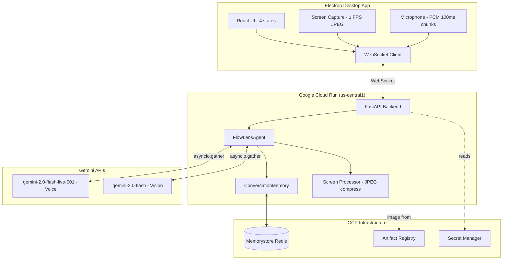

# Architecture Diagram

Place your architecture diagram here as `architecture.png` or `architecture.svg`.

You can generate one using:
- [draw.io](https://draw.io) (free, export as PNG)
- [Mermaid Live](https://mermaid.live) (paste diagram below, screenshot)

## Mermaid source

Copy this Mermaid source into [mermaid.live](https://mermaid.live), screenshot the result,
and save it as `docs/architecture.png`.
